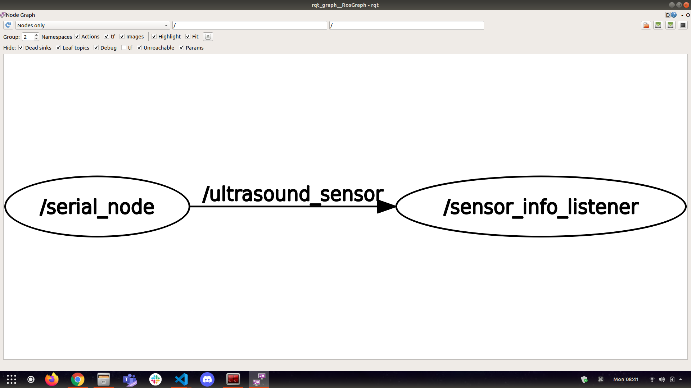
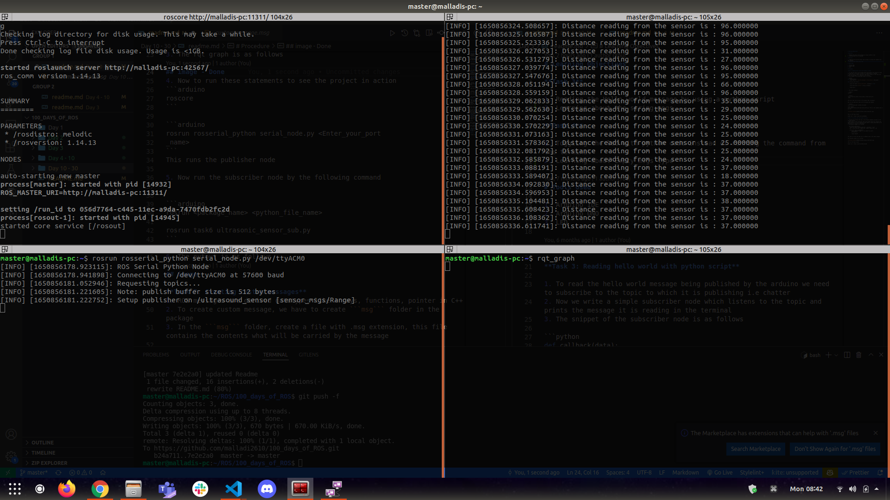
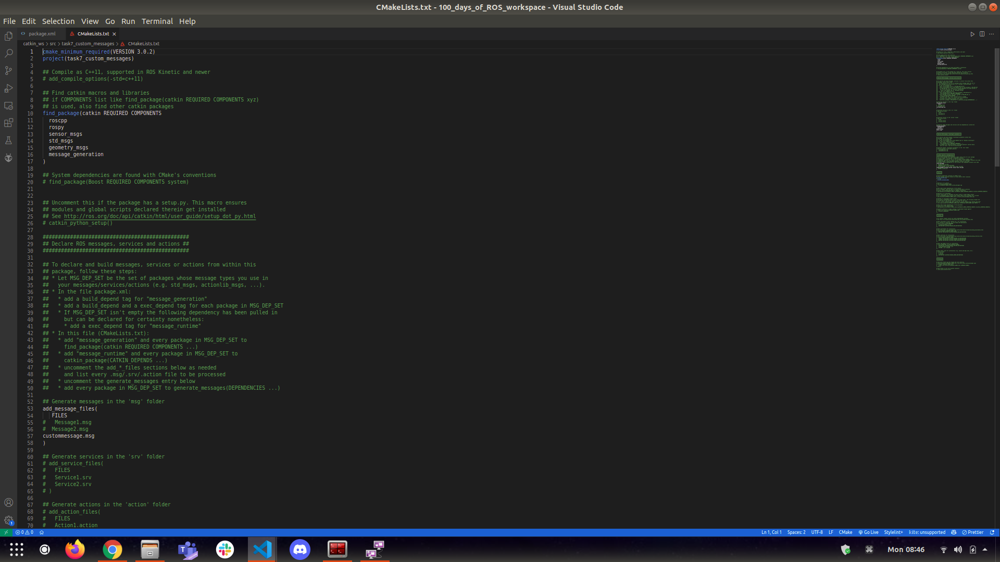
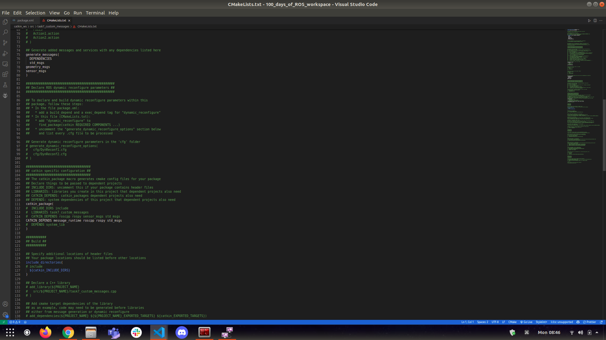
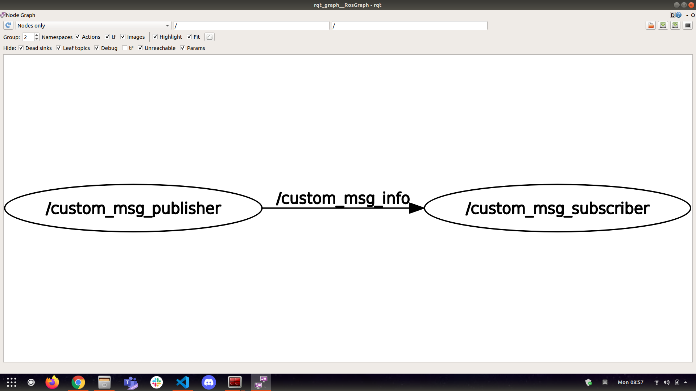

# Learning Objectives

**Task 7**
1. Interfacing of the Sensor with Arduino and reading the data from it using ROS
2. Learning about using the new message type i.e sensor_msgs

**Task 8**
1. Creating Custom messages and using them by creating a simple publisher and subscriber nodes

# Tools Used

1. Arduino IDE
2. Ultrasonic sensor

# Procedure

**Task 6: Interfacing of the ultrasonic sensor**

1. To interface the ultrasonic sensor with Arduino make the circuit connections as follows

2. Arduino acts as the publishers (range_msgs) and PC acts as subscriber (sensor_info_listener) and the data is published to the topic (/ultrasound_sensor)

3. The rqt graph is as follows

4. Now to run these statements to see the project in action
```arduino
roscore
```

```arduino
rosrun rosserial_python serial_node.py <Enter_your_port
_name>
```
This runs the publisher node

5. Now run the subscriber node by the following command


```arduino
rosrun <package_name> <python_file_name>

rosrun task6 ultrasonic_sensor_sub.py
```

6. The output is as follows


**Task 7: Creating custom messages**
1. ROS messages are derived datatypes like Arrays, functions, pointer in C++
2. To create custom message, we have to create ```msg``` folder in the package
3. In the ```msg``` folder, create a file with .msg extension, this file contains the contents what will be carried by the message

```
string name
uint32 number
```
Here the message will contain the name and the number
4.Now to let the ROS know that a custom message has been created, changes need to be done to the ```package.xml``` file and the ```CMakeList.txt``` file in the ROS package
5. The Changes to the package.xml is as follows

6. The CMakeList.txt is as follows



7. The files in the package are as follows
structure
```bash
|-- CMakeLists.txt
|-- include
|   `-- task7_custom_messages
|-- msg
|   `-- custommessage.msg
|-- package.xml
|-- scripts
|   |-- custom_msg_publisher.py
|    `-- custom_msg_subscriber.py
`-- src

5 directories, 5 files
```
8. Now to see the task in action run the following commands
```
roscore

rosrun <package_name> <python_file_name>  //To run the publisher
Ex. rosrun task7 custom_msg_publisher.py

rosrun <package_name> <python_file_name> //To run the subscriber
Ex. rosrun task7 custom_msg_subscriber.py
```
9. The output is as follows

10. The rqt_graph is as follows


# Result

**video link**
- Task 7:
- Task 8: https://youtu.be/o-UopI7PGlE
